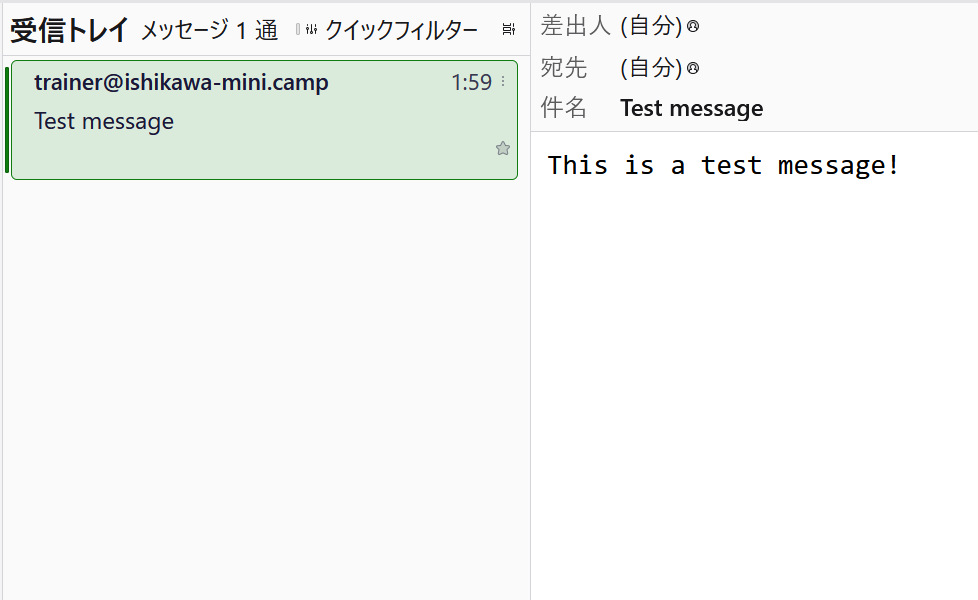
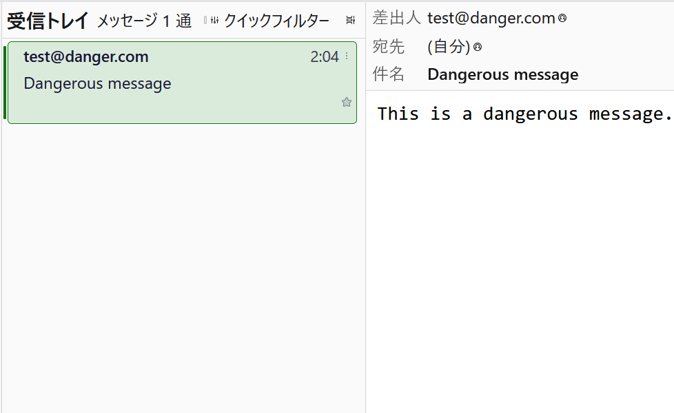

# telnetを使い、SMTPを手書きしてみよう

 「telnetを使い、SMTPを手書きしてみよう」ハンズオンの資料です。  
各自、自分のペースで進めてみて下さい。

## 事前準備

セキュリティ・キャンプ2025ミニ（石川開催）参加者の皆さんは、講師が用意したサーバーを利用できますので、事前準備は不要です。

ハンズオン用メールサーバーを自分で用意する場合は、[こちらの資料](./preparation/README.md)を利用して構築して下さい。

## SSHでサーバーにログインする

まずは、SSHでサーバーにログインし、今回の演習環境を遠隔操作できるようにしましょう！

今回、CLIと呼ばれる「文字でコマンドを打ち込んでコンピューターを操作する」方式を使います。  
Windowsの方は「PowerShell」を、Macの方は「ターミナル」を開いて下さい。  
開けたら、以下のコマンドを打ち込み、 Enterを押して実行します。

```bash
ssh user@{サーバーのIPアドレス}
```

`Are you sure you want to continue connecting (yes/no/[fingerprint])?`という表示が出たら`yes`と入力。  
`user@{サーバーのIPアドレス}'s password:`と聞かれたら、講師から配布された (もしくは自分で設定した) パスワードを入力してください。

以下のような文字列が出てきたら成功です！

```console
+---------------------------------------------------------------------+
|                                                                     |
|    _____                                                _       _   |
|   / ____|                                              (_)     (_)  |
|  | (___   ___  ___ ___ __ _ _ __ ___  _ __    _ __ ___  _ _ __  _   |
|   \___ \ / _ \/ __/ __/ _` | '_ ` _ \| '_ \  | '_ ` _ \| | '_ \| |  |
|   ____) |  __/ (_| (_| (_| | | | | | | |_) | | | | | | | | | | | |  |
|  |_____/ \___|\___\___\__,_|_| |_| |_| .__/  |_| |_| |_|_|_| |_|_|  |
|   _____     _     _ _                | |    ___   ___ ___  _____    |
|  |_   _|   | |   (_) |               |_|   |__ \ / _ \__ \| ____|   |
|    | |  ___| |__  _| | ____ ___      ____ _   ) | | | | ) | |__     |
|    | | / __| '_ \| | |/ / _` \ \ /\ / / _` | / /| | | |/ /|___ \    |
|   _| |_\__ \ | | | |   < (_| |\ V  V / (_| |/ /_| |_| / /_ ___) |   |
|  |_____|___/_| |_|_|_|\_\__,_| \_/\_/ \__,_|____|\___/____|____/    |
|                                                                     |
+---------------------------------------------------------------------+

セキュリティ・キャンプ2025ミニ（石川開催）
『ITエンジニアとして知っておいてほしい、電子メールという大きな穴』
ハンズオン用 メールサーバー へようこそ！
Last login: {時間} from {IPアドレス}
user@server-ishikawa-mini-camp:~$
```

## 正常なメールを送ってみよう

### telnetでハンズオン用SMTPサーバーに接続する

SMTPサーバーに接続してみましょう。  
以下のコマンドで、ハンズオン用SMTPサーバーに接続します。

```bash
telnet server.ishikawa-mini.camp 25
```

以下のような表示が出れば、正常に接続できています。

```console
user@server-ishikawa-mini-camp:~$ telnet server.ishikawa-mini.camp 25
Trying 127.0.0.1...
Connected to server.ishikawa-mini.camp.
Escape character is '^]'.
220 server.ishikawa-mini.camp ESMTP Postfix (Ubuntu)
```

---

<details>
<summary>コマンドに関する補足説明</summary>

telnetは、本来SSH同様、他のコンピューターを遠隔操作するために生まれたコマンドです。  
現在はSSHが主流になり、上記の目的ではほぼ使われなくなりました。

telnetは今回のように、任意のアドレス・ポートに対してTCP接続を行い、手書きでデータをやり取りするという目的でも使うことができます。  
今回は、SMTPプロトコルを手書きするという目的のため、telnetを使ってTCP接続を行い、その上でSMTPプロトコルのテキストを送り合う方式を採用しました。

今回のコマンドでは、`server.ishikawa-mini.camp`というアドレスの25番ポート (SMTP通信用ポート) に対して接続しています。

`server.ishikawa-mini.camp`は今ログインしているサーバー自身を示しています。  
以下のコマンドで確認してみると良いでしょう。

```bash
cat /etc/hosts
```

今回用意した環境ではPostfixというメールサーバーソフトウェアが動作しており、そこに対してSMTP接続を行っています。  
わざわざ自分自身に対してSMTP接続を行うのは不思議に思えるかもしれませんが、これはOP25B (講義で補足) という仕組みの回避策です。

</details>

---

### ⚠️注意事項⚠️

今回の環境からメールを送る際、日本語が含まれていると**文字化け**してしまいます！  
メールの件名・本文には**英数字のみ**を利用するようにしてください。

### SMTPを手書きしてみる

講義で触れたとおり、SMTPは**対話型のプロトコル**です。  
コマンドを一つ一つ入力して自分の情報 / メールの情報を渡し、それぞれに対してサーバーが応答を返してくれます。

以下のような流れで送信を行います。  
全ての場所に置いて、**日本語を入力してしまうと文字化けします**！  
ご注意ください。

- 自己紹介をする
  - まずは自己紹介をします。以下の文字列を入力して下さい。
  - `{自分の好きな文字列}`は本来自分のアドレスを入れますが、適当な文字列でも大丈夫です。

  ```plaintext
  HELO {自分の好きな文字列}
  ```

  - `250 server.ishikawa-mini.camp`と出れば成功です！
- 送り主を伝える
  - 送り主のアドレスを伝えます。以下の文字列を入力してください。
  - `{自分のメールアドレス}`は、各自置き換えてください。

  ```plaintext
  MAIL FROM: {自分のメールアドレス}
  ```

  - `250 2.1.0 Ok`と出れば成功です！
- 宛先を伝える
  - 宛先のアドレスを伝えます。以下の文字列を入力してください。
  - 今回は講師のPCで受信するため、**宛先は固定**です。

  ```plaintext
  RCPT TO: trainer@ishikawa-mini.camp
  ```

  - `250 2.1.5 Ok`と出れば成功です！
- メールの内容を入力する
  - メールの内容を入力します。まずは以下の文字列を入力してください。

  ```plaintext
  DATA
  ```

  - `354 End data with <CR><LF>.<CR><LF>`と出て、**情報を入力する準備が整った**ことが通知されます。
  - その後、以下のように文字列を入力します。`{}`で囲まれた文字列は、適宜置き換えてください。

  ```plaintext
  From: {自分のメールアドレス}
  To: trainer@ishikawa-mini.camp
  Subject: {メールの件名 (自由)}

  {メールの本文 (自由)}
  .
  ```

  - **最後の`.`(ピリオド) を打った後にEnterを押す**と、メールが送信されます。
    - `250 2.0.0 OK: queued as {メールID}`と出れば成功です！
- SMTPを終了する
  - 最後に、以下の文字列を入力してください。

  ```plaintext
  QUIT
  ```

  - `221 2.0.0 Bye`と出て、コマンドが終了していれば成功です！
  - これでSMTP通信が終了しました。

以上のコマンドを打ち終わると、下のようなログになるはずです。

```console
user@server-ishikawa-mini-camp:~$ telnet server.ishikawa-mini.camp 25
Trying 127.0.0.1...
Connected to server.ishikawa-mini.camp.
Escape character is '^]'.
220 server.ishikawa-mini.camp ESMTP Postfix (Ubuntu)
HELO localhost
250 server.ishikawa-mini.camp
MAIL FROM: trainer@ishikawa-mini.camp
250 2.1.0 Ok
RCPT TO: trainer@ishikawa-mini.camp
250 2.1.5 Ok
DATA
354 End data with <CR><LF>.<CR><LF>
From: trainer@ishikawa-mini.camp
To: trainer@ishikawa-mini.camp
Subject: Test message

This is a test message!
.
250 2.0.0 Ok: queued as 20837C1009
QUIT
221 2.0.0 Bye
Connection closed by foreign host.
```

---

<details>
<summary>コマンドに関する補足説明</summary>

- `HELO`コマンド
  - SMTPサーバーに対して自分の情報を伝えるためのコマンドです。
  - 本来は、自分側のメールサーバーのアドレス (`security-camp.or.jp`など) を打ち込みますが、この部分は適当な文字列でも通ります。
- `MAIL FROM`コマンド
  - 送り主のアドレスを伝えるためのコマンドですが、ほぼ意味を成していません。
  - 「エンベロープFrom」と呼ばれます。
  - 何のアドレスを入れても良いです。
- `RCPT TO`コマンド
  - 宛先のアドレスを伝えるためのコマンドです。
- `DATA`コマンド
  - メールの内容を入力するためのコマンドです。
  - 最初に「ヘッダ」と呼ばれる、メールに関するメタ情報を羅列し、一度空行を挟んだ後、`改行 + ピリオド + 改行`までが本文とみなされます。
  - `From`ヘッダ
    - **メールを表示するときに**、送り主として表示するための情報です。
    - 「ヘッダFrom」と呼ばれます。
    - メールの伝送のために使われることはありません。
    - SMTPでは本来どんなアドレスでも入れて良いですが、Brevoの独自規制で、Brevoに登録したメールアドレスを入れる必要があります。
  - `To`ヘッダ
    - **メールを表示するときに**、宛先として表示するための情報です。
    - メールの伝送のために使われることはありません。
- `QUIT`コマンド
  - SMTP通信を終了するためのコマンドです。

</details>

---

### 正しく送られたことを確かめる

セキュリティ・キャンプ2025ミニ（石川開催）参加者の皆さんは、講師のPCでメールが受信できているか確かめてみましょう。  
以下の画像のように、受信トレイにメールが届いているはずです。



ハンズオン用メールサーバーを自分で用意した場合は、Dovecot (IMAPサーバー) が動作しているため、送信したメールはそこから受信できます。

## 危険なメールを送信してみよう

ここまででSMTPを直接手書きできるようになったため、ここからは**あえて危険なメールをシミュレート**してみましょう。

### Fromの改変 (なりすまし)

以下のように、`MAIL FROM`と`DATA`で入力する`From`部分を変更します。  
自分が持っていようが持っていまいが、自由なアドレスでかまいません。

```console
user@server-ishikawa-mini-camp:~$ telnet server.ishikawa-mini.camp 25
(省略)
MAIL FROM: test@danger.com
250 2.1.0 Ok
RCPT TO: trainer@ishikawa-mini.camp
250 2.1.5 Ok
DATA
354 End data with <CR><LF>.<CR><LF>
From: test@danger.com
To: trainer@ishikawa-mini.camp
Subject: Dangerous message

This is a dangerous message.
.
250 2.0.0 Ok: queued as 62D48C1009
```

あなたの設定したメールアドレスが送り主になったメールが送られているはずです。



## 自由にメールを送信してみよう

ここまでのハンズオンで得た知識を活かして、いろんな宛名や内容でメールを送信してみましょう！  
どの部分を変えればどんなメールが送れるのか、色々実験してみて下さい。

普段メールを送信する際、このようなプロトコルが後ろにあるんだなぁと思って下さると幸いです。

### ⚠️注意事項⚠️

**他人に危険なメールを送ることは犯罪になり得ます！**  
十分注意してください。

## 参考文献

- <https://www.tohoho-web.com/ex/draft/smtp.htm>
- <https://www.tohoho-web.com/ex/draft/smtp-auth.htm>
- <https://baremail.jp/blog/2021/05/25/1377/>
- <https://qiita.com/uenosy/items/1c95701bf743236a2f6b>
