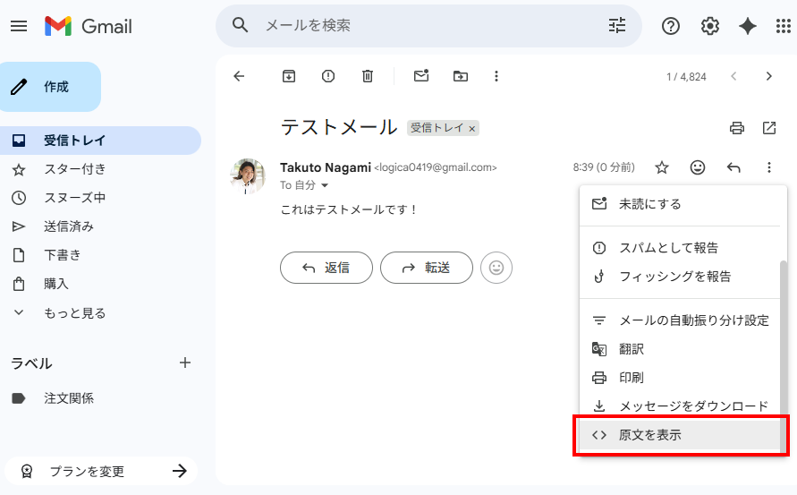
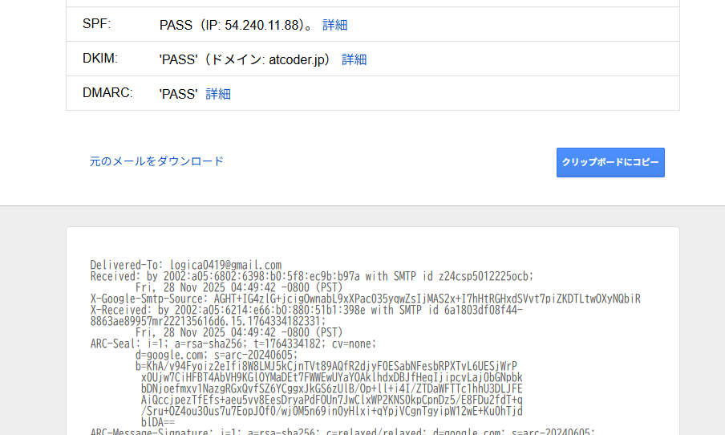
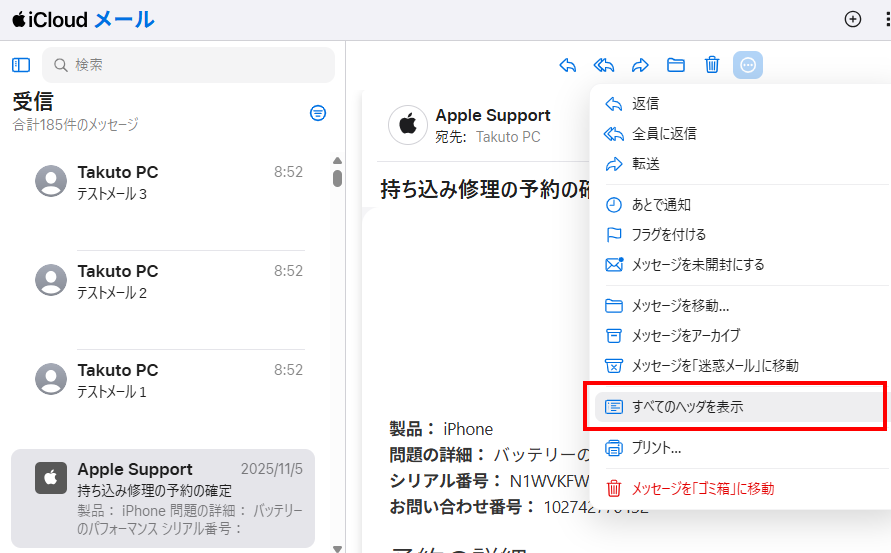
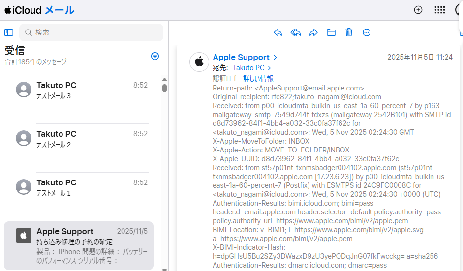
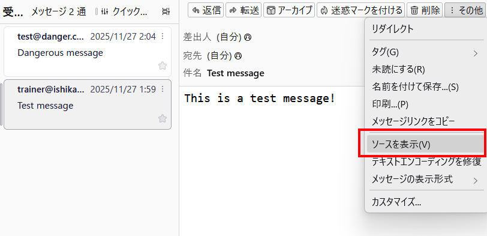
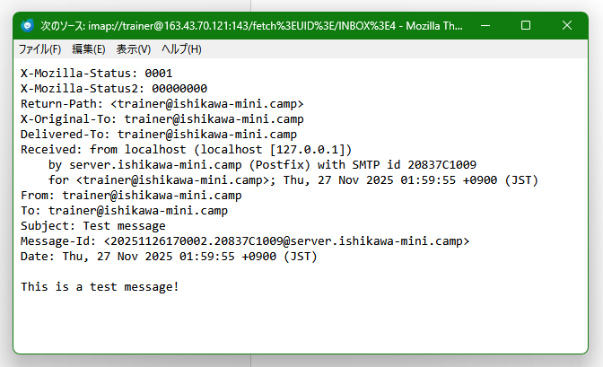
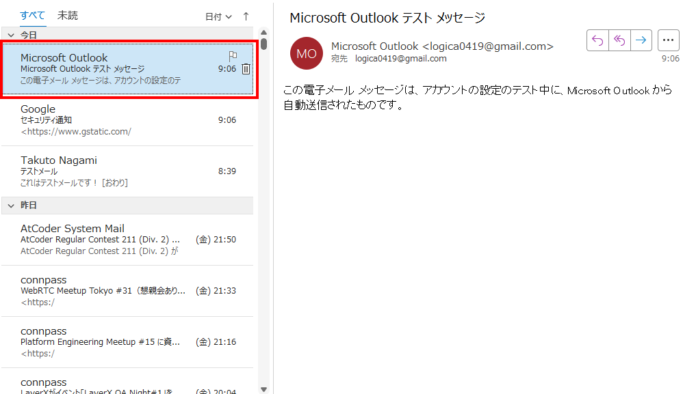
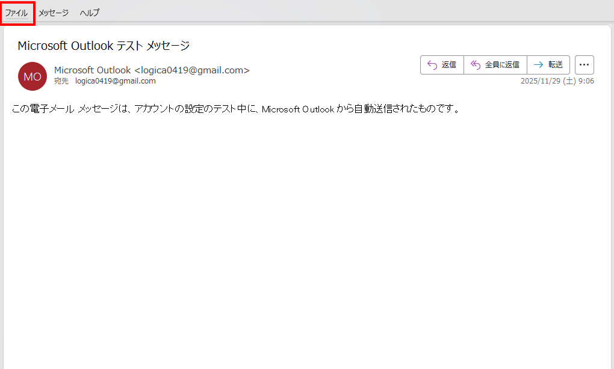
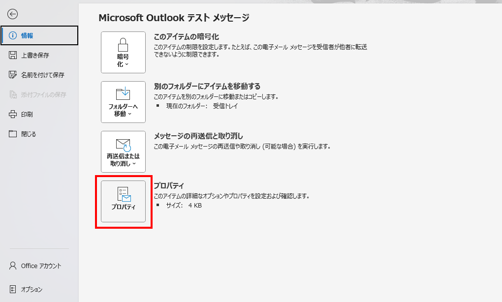
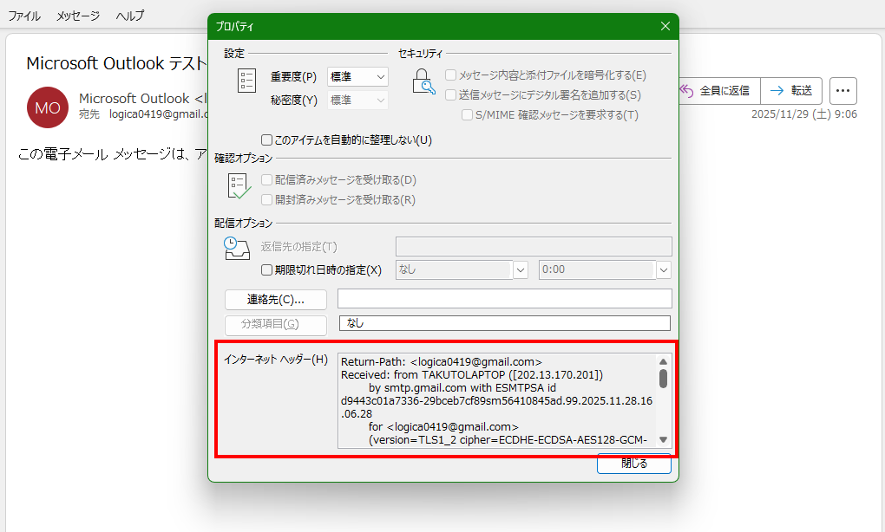

# 普段受信しているメールのソースを見てみよう

「普段受信しているメールのソースを見てみよう」ハンズオンの資料です。  
各自、自分のペースで進めてみて下さい。

## メールのソースとは

ほとんどのメールクライアント (メールを閲覧するためのソフトウェア) では、SMTPの`DATA`コマンドで送信された部分全体を「メールのソース」として見ることができます。

ソースにはヘッダと本文が含まれており、特にヘッダを見ると、DKIMやARCによって付与された署名情報・DMARCの検証結果・BIMIのアイコンURLなどが確認できます。  
また、いくつかのメールクライアントでは、ソースを表示した際にSPFやDKIM、DMARCの検証結果も確認できます。

## メールのソースを見る方法

### Gmailの場合

ソースを見たいメールを開き、 右上の「︙」アイコンをクリックして表示されるメニューから、「原文を表示」を選択します。  
Gmailでは、ソースを表示した際にSPFやDKIM、DMARCの検証結果も確認できます。

---

### iCloud Mailの場合

iCloud Mailではソース全体を見ることはできませんが、全てのヘッダを確認することができます。  
ヘッダを見たいメールを開き、 右上の「⋯」アイコンをクリックして表示されるメニューから、「全てのヘッダを表示」を選択します。

---

### Thunderbirdの場合

ソースを見たいメールを開き、「その他」→「ソースを表示」を選択します。

---

### Outlookの場合

Outlookではソース全体を見ることはできませんが、全てのヘッダを確認することができます。  
他のメールクライアントと比べると少々手間がかかります。

まずメール一覧より、ソースを見たいメールをダブルクリックします。  
個別のメール閲覧用ウインドウが表示されるはずです。

次に「ファイル」タブをクリック。

さらに「プロパティ」をクリックします。

すると「インターネット ヘッダー」欄にヘッダ一覧が表示されます。

## 色々なメールを見てみよう

普段受信しているメールの中には、セキュリティプロトコルが適切に設定されているものもあれば、そうでないものもあります。  
色々なメールのソースを見て、どのような違いがあるか確認してみましょう。

また、講義中に扱ったセキュリティプロトコルを、メールのヘッダ中にできるだけ多く見つけてみて下さい。  
講師は以下のプロトコルを見つけることができました。ここに載っていないプトロコルを見つけた方は、ぜひ講師に教えて下さい。

- SPF
- DKIM
- DMARC
- BIMI
- ARC
